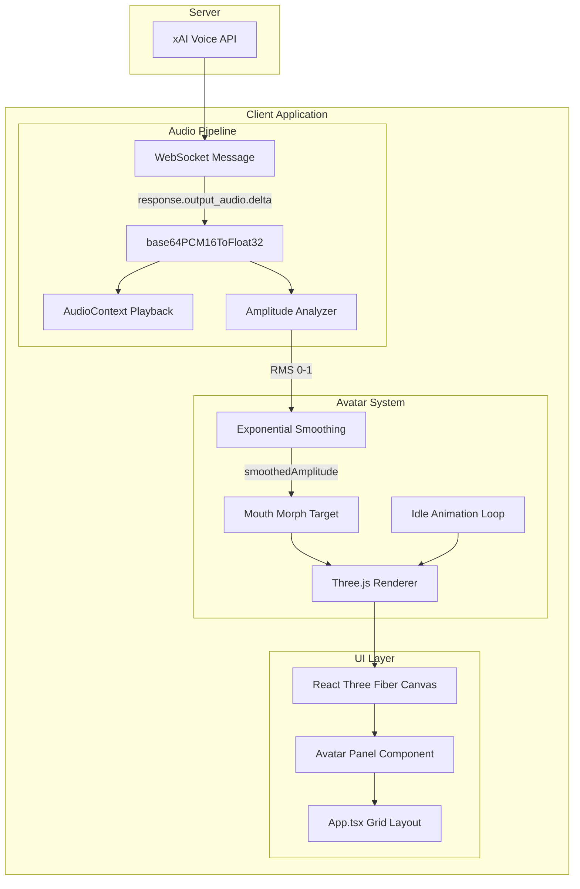
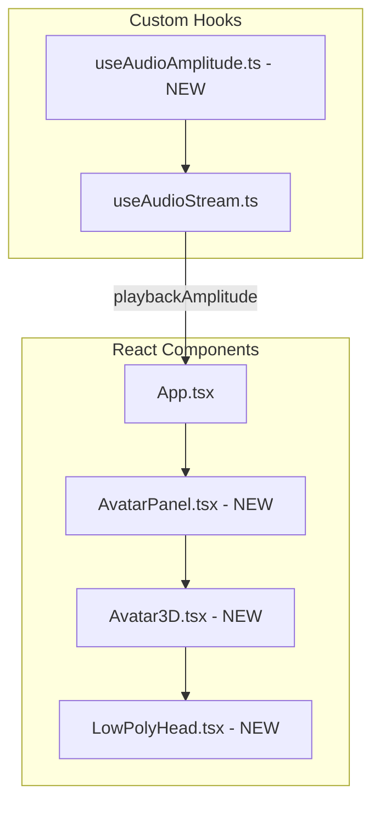

# Low-Polygon Avatar with Lip-Sync - Technical Design Document

## 1. Overview

### 1.1 Goal

Add an interactive 3D low-polygon avatar to the WebRTC voice application that synchronizes mouth movements with AI audio output, creating a more engaging and human-like interaction experience.

### 1.2 Current System Architecture

The existing application uses:

- **Client**: React 19 + Vite + TypeScript
- **Audio Flow**: AI audio arrives as `response.output_audio.delta` WebSocket messages containing base64-encoded PCM16 audio
- **Playback**: `useAudioStream` hook converts audio to Float32 and plays via Web Audio API
- **UI**: Dark theme with grid-based layout (TopBar, ControlPanel, WebRTC Stats, Transcript, Debug Console)

### 1.3 Proposed Solution

Integrate a Three.js-based 3D avatar that:

1. Renders a stylized low-poly human head
2. Analyzes audio amplitude in real-time during playback
3. Animates mouth opening proportionally to speech volume
4. Includes subtle idle animations for liveliness

---

## 2. System Architecture

### 2.1 Data Flow Diagram



### 2.2 Component Architecture



---

## 3. Technical Specifications

### 3.1 New Dependencies

| Package | Version | Purpose ||---------|---------|---------|| `three` | ^0.170.0 | Core 3D rendering library || `@react-three/fiber` | ^8.17.0 | React renderer for Three.js || `@react-three/drei` | ^9.117.0 | Useful Three.js helpers and abstractions || `@types/three` | ^0.170.0 | TypeScript definitions |

### 3.2 File Structure (New Files)

```
client/
├── public/
│   └── models/
│       └── head.glb            # NEW - Low-poly head with morph targets
├── src/
│   ├── hooks/
│   │   └── useAudioAmplitude.ts    # NEW - Audio amplitude analysis
│   └── components/
│       ├── AvatarPanel.tsx         # NEW - Container panel
│       └── avatar/                  # NEW - Avatar subcomponents
│           ├── Avatar3D.tsx        # Main 3D scene setup
│           ├── LowPolyHead.tsx     # Head component using GLB
│           └── types.ts            # Avatar-related types
```

### 3.3 Type Definitions (`types.ts`)

```typescript
import { MutableRefObject } from 'react';

export interface AvatarProps {
  /** Ref to amplitude value (0-1), updated via AnalyserNode */
  amplitudeRef: MutableRefObject<number>;
  /** Whether AI is currently speaking */
  isSpeaking: boolean;
}

export interface LowPolyHeadProps {
  /** Ref to amplitude value for mouth animation */
  amplitudeRef: MutableRefObject<number>;
}

export interface HeadMorphTargets {
  /** Mouth open amount (0 = closed, 1 = fully open) */
  mouthOpen: number;
}
```

---

## 4. Detailed Implementation

### 4.1 Audio Amplitude Analysis (`useAudioAmplitude.ts`)

**Purpose**: Extract real-time amplitude from audio playback for lip-sync using Web Audio API's AnalyserNode.

**Why AnalyserNode over Callback**: Audio chunks arrive irregularly via WebSocket. Using a callback per chunk would cause discrete jumps in mouth animation. AnalyserNode provides continuous, frame-synchronized amplitude sampling regardless of chunk timing.

**Implementation**:

```typescript
import { useRef, useCallback, useEffect } from 'react';

interface UseAudioAmplitudeReturn {
  /** Ref containing current amplitude (0-1), read in useFrame */
  amplitudeRef: React.MutableRefObject<number>;
  /** AnalyserNode to connect to audio graph */
  analyserNode: AnalyserNode | null;
  /** Create analyser for given AudioContext */
  createAnalyser: (audioContext: AudioContext) => AnalyserNode;
  /** Start continuous amplitude sampling */
  startSampling: () => void;
  /** Stop sampling and reset amplitude */
  stopSampling: () => void;
}

const SMOOTHING_UP = 0.3;    // Fast rise when audio starts
const SMOOTHING_DOWN = 0.1;  // Slow decay when audio stops
const AMPLITUDE_SCALE = 3.0; // Normalize quiet audio
const FFT_SIZE = 256;        // Small FFT for performance

export function useAudioAmplitude(): UseAudioAmplitudeReturn {
  const amplitudeRef = useRef(0);
  const analyserRef = useRef<AnalyserNode | null>(null);
  const dataArrayRef = useRef<Uint8Array | null>(null);
  const rafIdRef = useRef<number | null>(null);

  const createAnalyser = useCallback((audioContext: AudioContext) => {
    const analyser = audioContext.createAnalyser();
    analyser.fftSize = FFT_SIZE;
    analyser.smoothingTimeConstant = 0.3;
    analyserRef.current = analyser;
    dataArrayRef.current = new Uint8Array(analyser.frequencyBinCount);
    return analyser;
  }, []);

  const sample = useCallback(() => {
    if (!analyserRef.current || !dataArrayRef.current) return;

    analyserRef.current.getByteFrequencyData(dataArrayRef.current);

    // Calculate average amplitude from frequency data
    let sum = 0;
    for (let i = 0; i < dataArrayRef.current.length; i++) {
      sum += dataArrayRef.current[i];
    }
    const average = sum / dataArrayRef.current.length / 255; // Normalize to 0-1
    const scaled = Math.min(1, average * AMPLITUDE_SCALE);

    // Exponential smoothing with asymmetric rise/fall
    const current = amplitudeRef.current;
    const factor = scaled > current ? SMOOTHING_UP : SMOOTHING_DOWN;
    amplitudeRef.current = current + (scaled - current) * factor;

    rafIdRef.current = requestAnimationFrame(sample);
  }, []);

  const startSampling = useCallback(() => {
    if (rafIdRef.current) return; // Already sampling
    sample();
  }, [sample]);

  const stopSampling = useCallback(() => {
    if (rafIdRef.current) {
      cancelAnimationFrame(rafIdRef.current);
      rafIdRef.current = null;
    }
    amplitudeRef.current = 0;
  }, []);

  useEffect(() => {
    return () => stopSampling(); // Cleanup on unmount
  }, [stopSampling]);

  return {
    amplitudeRef,
    analyserNode: analyserRef.current,
    createAnalyser,
    startSampling,
    stopSampling,
  };
}
```

**Key Design Decisions**:

- **Ref instead of State**: `amplitudeRef` is read directly in `useFrame` without triggering React re-renders (60fps updates would kill performance)
- **requestAnimationFrame**: Sampling is synchronized with display refresh rate
- **Asymmetric smoothing**: Mouth opens quickly (responsive), closes slowly (natural)
- **Frequency data over time-domain**: Better for detecting speech presence

### 4.2 Modified Audio Stream (`useAudioStream.ts`)

**Changes Required**:

1. Accept an optional `AnalyserNode` to connect to the audio graph:

```typescript
interface UseAudioStreamOptions {
  analyserNode?: AnalyserNode | null;
}

export function useAudioStream({ analyserNode }: UseAudioStreamOptions = {})
```

2. Connect analyser in the audio routing chain:

```typescript
// Current flow:
// sourceNode -> gainNode -> audioContext.destination

// New flow with analyser:
// sourceNode -> analyserNode -> gainNode -> audioContext.destination

const playAudio = useCallback((base64Audio: string) => {
  const float32Data = base64PCM16ToFloat32(base64Audio);

  const buffer = audioContextRef.current.createBuffer(1, float32Data.length, 24000);
  buffer.getChannelData(0).set(float32Data);

  const source = audioContextRef.current.createBufferSource();
  source.buffer = buffer;

  // Connect through analyser if provided
  if (analyserNode) {
    source.connect(analyserNode);
    analyserNode.connect(gainNodeRef.current);
  } else {
    source.connect(gainNodeRef.current);
  }

  gainNodeRef.current.connect(audioContextRef.current.destination);
  source.start(nextStartTimeRef.current);
  // ... rest of existing code
}, [analyserNode]);
```

3. Expose connection status for UI feedback:

```typescript
interface UseAudioStreamReturn {
  playAudio: (base64Audio: string) => void;
  isPlaying: boolean;
  // ... existing returns
}
```

### 4.3 Low-Poly Head Component (`LowPolyHead.tsx`)

**Approach**: Load a pre-made GLB model with morph targets defined in Blender. This provides clean separation between 3D modeling and code, making it easy to iterate on the design.

**GLB Model Requirements** (`public/models/head.glb`):

- ~80 faces (icosphere with 1 subdivision in Blender)
- Shape key named "mouthOpen" for lip-sync
- Origin centered at head center
- Forward direction: +Z axis
- Scale: ~1 unit radius

**Blender Workflow**:

1. Create icosphere (Subdivisions: 1 = 80 faces)
2. Sculpt into head shape (optional: add basic eye indentations)
3. Add Shape Key "Basis" (closed mouth state)
4. Add Shape Key "mouthOpen" and sculpt open mouth
5. Export as GLB with "Shape Keys" enabled

**Implementation**:

```typescript
import { useRef } from 'react';
import { useGLTF } from '@react-three/drei';
import { useFrame } from '@react-three/fiber';
import * as THREE from 'three';
import { LowPolyHeadProps } from './types';

// Preload for faster initial render
useGLTF.preload('/models/head.glb');

export function LowPolyHead({ amplitudeRef }: LowPolyHeadProps) {
  const meshRef = useRef<THREE.Mesh>(null);
  const { nodes } = useGLTF('/models/head.glb');

  // Access the head mesh (adjust name based on Blender export)
  const headGeometry = (nodes.Head as THREE.Mesh).geometry;

  useFrame((state) => {
    if (!meshRef.current) return;

    const mesh = meshRef.current;
    const t = state.clock.elapsedTime;

    // Mouth animation from amplitude (morph target index 0 = mouthOpen)
    if (mesh.morphTargetInfluences) {
      mesh.morphTargetInfluences[0] = amplitudeRef.current;
    }

    // Idle animations
    mesh.scale.y = 1 + Math.sin(t * 0.8) * 0.01;  // Breathing
    mesh.rotation.y = Math.sin(t * 0.2) * 0.02;   // Subtle sway
    mesh.rotation.x = Math.sin(t * 0.15) * 0.01;  // Subtle nod
  });

  return (
    <mesh ref={meshRef} geometry={headGeometry}>
      <meshStandardMaterial
        color="#2a2a2a"
        flatShading={true}
        metalness={0.1}
        roughness={0.8}
      />
    </mesh>
  );
}
```

**Key Points**:

- `useGLTF.preload()` ensures model loads before component renders
- `amplitudeRef` is read directly in `useFrame` - no React state updates
- Morph target index depends on Shape Key order in Blender (first = 0)
- Idle animation frequencies reduced for subtlety (0.8Hz breathing, 0.2Hz sway)

### 4.4 Scene Setup (`Avatar3D.tsx`)

**Lighting**:

```typescript
<ambientLight intensity={0.4} />
<directionalLight position={[5, 5, 5]} intensity={0.8} />
<pointLight position={[-5, 0, 5]} intensity={0.3} color="#4fc3f7" />
```

**Camera**:

- Position: [0, 0, 3]
- FOV: 50
- Focus on head center

**Materials**:

```typescript
<meshStandardMaterial
  color="#2a2a2a"        // Dark gray base
  flatShading={true}      // Essential for low-poly look
  metalness={0.1}
  roughness={0.8}
/>
```

### 4.5 Idle Animations

Idle animations are integrated directly in `LowPolyHead.tsx` within the same `useFrame` callback as mouth animation for efficiency.

**Breathing Effect** (0.8Hz = ~5s cycle):

```typescript
mesh.scale.y = 1 + Math.sin(t * 0.8) * 0.01;
```

**Head Micro-Movement** (0.2Hz = ~30s full cycle):

```typescript
mesh.rotation.y = Math.sin(t * 0.2) * 0.02;  // Side-to-side sway
mesh.rotation.x = Math.sin(t * 0.15) * 0.01; // Subtle nodding
```

**Design Rationale**:

- Frequencies are intentionally slow to feel natural, not robotic
- Amplitudes are small (1% scale, 1-2 degree rotation) to avoid distraction
- Different frequencies for X and Y rotation prevent repetitive-looking loops

---

## 5. UI Layout Integration

### 5.1 New Layout (Avatar Sidebar)

The avatar will occupy a prominent left sidebar, with all other UI elements on the right side.

```javascript
┌──────────────────┬──────────────────────────────────────────┐
│                  │   ControlPanel    │    WebRTC Stats      │
│                  ├───────────────────-──────────────────────┤
│   AvatarPanel    │                                          │
│                  │  TranscriptPanel                         │
│   (3D Low-Poly   │                                          │
│      Head)       │                                          │
│                  │                                          │
└──────────────────┴───────────────────┴──────────────────────┘
```

**Layout Specifications**:

- **Avatar Panel Width**: ~300-350px fixed width (or ~25% of viewport)
- **Avatar Panel Height**: Full viewport height (100vh)
- **Right Side**: Flex column containing all existing components
- **Grid Structure**: CSS Grid with `grid-template-columns: 350px 1fr`

### 5.2 State Flow Architecture

**Amplitude flows via ref, not React state**, to avoid 60fps re-renders:

```
App.tsx
├── useAudioAmplitude() → amplitudeRef, createAnalyser, startSampling, stopSampling
├── useAudioStream({ analyserNode }) → playAudio, isPlaying
│
├── <AvatarPanel amplitudeRef={amplitudeRef} isSpeaking={isPlaying}>
│   └── <Avatar3D amplitudeRef={amplitudeRef}>
│       └── <LowPolyHead amplitudeRef={amplitudeRef}>
│           └── useFrame(() => mesh.morphTargetInfluences[0] = amplitudeRef.current)
```

**Wiring in App.tsx**:

```typescript
function App() {
  const { amplitudeRef, createAnalyser, startSampling, stopSampling } = useAudioAmplitude();
  const [analyserNode, setAnalyserNode] = useState<AnalyserNode | null>(null);

  // Create analyser when audio context is ready
  useEffect(() => {
    if (audioContextRef.current && !analyserNode) {
      const node = createAnalyser(audioContextRef.current);
      setAnalyserNode(node);
    }
  }, [audioContextRef.current]);

  const { playAudio, isPlaying } = useAudioStream({ analyserNode });

  // Start/stop sampling based on playback state
  useEffect(() => {
    if (isPlaying) {
      startSampling();
    } else {
      stopSampling();
    }
  }, [isPlaying]);

  return (
    <div className="app-container">
      <AvatarPanel amplitudeRef={amplitudeRef} isSpeaking={isPlaying} />
      {/* ... rest of UI */}
    </div>
  );
}
```

### 5.3 Tailwind Styling

**Root Layout (`App.tsx`)**:

```tsx
<div className="grid grid-cols-[350px_1fr] h-screen bg-black">
  {/* Left sidebar - Avatar */}
  <div className="flex flex-col border-r-2 border-white p-4">
    <AvatarPanel amplitudeRef={amplitudeRef} isSpeaking={isPlaying} />
  </div>

  {/* Right content area */}
  <div className="flex flex-col overflow-hidden">
    {/* ControlPanel, TranscriptPanel, etc. */}
  </div>
</div>
```

**AvatarPanel Container**:

```tsx
export function AvatarPanel({ amplitudeRef, isSpeaking }: AvatarProps) {
  return (
    <div className="flex-1 flex items-center justify-center">
      <Suspense fallback={<div className="text-white">Loading...</div>}>
        <Canvas camera={{ position: [0, 0, 3], fov: 50 }}>
          <Avatar3D amplitudeRef={amplitudeRef} />
        </Canvas>
      </Suspense>
    </div>
  );
}
```

**Responsive Variant** (optional):

```tsx
{/* Collapse avatar on small screens */}
<div className="grid grid-cols-1 md:grid-cols-[350px_1fr] h-screen bg-black">
```

---

## 6. Visual Design Specifications

### 6.1 Avatar Aesthetic

**Style**: Minimalist low-poly, inspired by modern 3D art**Color Palette**:| Element | Color | Hex ||---------|-------|-----|| Head Base | Dark Charcoal | #2a2a2a || Rim Light | Cyan Accent | #4fc3f7 || Eye Highlight | Soft White | #e0e0e0 || Background | Match App | #000000 |**Polygon Count Target**: ~80-160 triangles (icosahedron with 1-2 subdivisions)

### 6.2 Animation Timing

| Animation | Duration/Cycle | Easing |
|-----------|----------------|--------|
| Mouth Open | ~50ms | Linear (real-time) |
| Mouth Close | ~150ms | Exponential decay |
| Idle Breathing | ~5s cycle (0.8Hz) | Sine wave |
| Head Sway (Y) | ~30s cycle (0.2Hz) | Sine wave |
| Head Nod (X) | ~40s cycle (0.15Hz) | Sine wave |

---

## 7. Implementation Checklist

### Phase 1: Foundation (Parallel Tracks)

**Track A - 3D Setup:**
- [ ] Install Three.js dependencies (`three`, `@react-three/fiber`, `@react-three/drei`)
- [ ] Create `Avatar3D.tsx` with basic scene (lighting, camera)
- [ ] Test with placeholder geometry

**Track B - GLB Model:**
- [ ] Create low-poly head in Blender (icosphere, ~80 faces)
- [ ] Add "mouthOpen" shape key
- [ ] Export as `head.glb` to `public/models/`

### Phase 2: Avatar Component

- [ ] Create `LowPolyHead.tsx` using `useGLTF`
- [ ] Implement mock amplitude for testing (oscillating sine wave)
- [ ] Add idle animations (breathing, micro-movement)
- [ ] Verify morph target works with mock amplitude

### Phase 3: Audio Integration

- [ ] Create `useAudioAmplitude.ts` with AnalyserNode
- [ ] Modify `useAudioStream.ts` to accept and connect AnalyserNode
- [ ] Wire amplitude sampling start/stop to playback state

### Phase 4: UI Integration

- [ ] Create `AvatarPanel.tsx` container with Suspense
- [ ] Update `App.tsx` layout (CSS Grid sidebar)
- [ ] Connect real `amplitudeRef` to avatar
- [ ] Style to match existing dark theme

### Phase 5: Polish

- [ ] Fine-tune smoothing parameters (SMOOTHING_UP, SMOOTHING_DOWN, AMPLITUDE_SCALE)
- [ ] Test with various audio volumes
- [ ] Add optional eye blink shape key (future enhancement)

---
